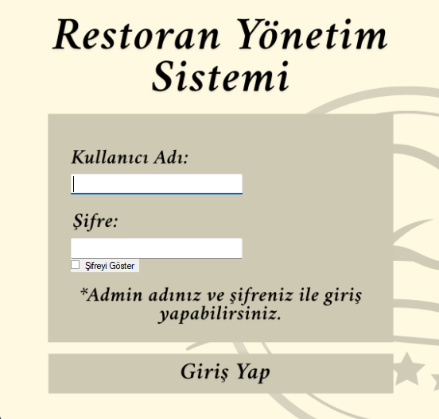
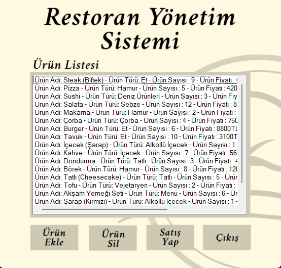

# 🍽️ Restoran Yönetim Sistemi

Bu proje, **C# Windows Forms** kullanılarak geliştirilmiş bir **Restoran Yönetim Sistemi** uygulamasıdır. Kullanıcılar, sistem üzerinden menüleri görüntüleyebilir, sipariş işlemlerini yönetebilir. Proje eğitim amaçlıdır.

## 🧩 Özellikler

- Menüleri listeleme  
- Sipariş oluşturma ve düzenleme  
- Masa durumlarını izleme  
- Basit ve kullanıcı dostu arayüz  

## 🛠️ Kullanılan Teknolojiler

- C# (Windows Forms)  
- .NET Framework  
- Visual Studio  
- (Opsiyonel: JSON, XML ya da SQL Server ile veri saklama)  

## 🖼️ Uygulama İçi Ekran Görüntüleri

  

